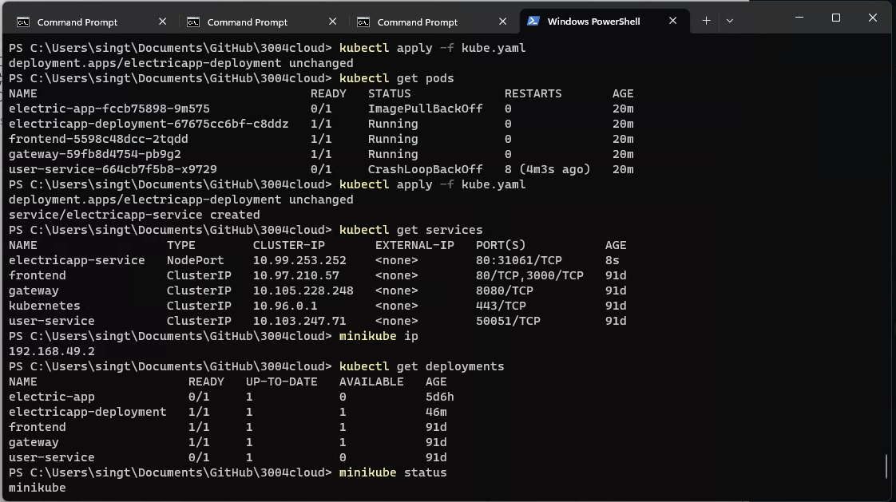

# CSC3004 Cloud and Distributed Computing

## To run project
- Create virtualenv folder to install Python dependencies (*Note: python can be python3 or py or python depending on your Python installation): ```python -m venv venv```
- Run virtualenv (on Windows): ```venv\Scripts\activate```
- Change directory: ```cd ElectricApp```
- Install Python dependencies: ```pip install -r requirements.txt```
- Run Services through 
    - Ang Mo Kio: ```python -m services.amk_accsvc``` and ```python -m services.amk_mlsvc```
    - Hougang: ```python -m services.hg_accsvc``` and ```python -m services.hg_mlsvc```
    - Jurong:```python -m services.jurong_accsvc``` and ```python -m services.jurong_mlsvc```
- Run application: ```python -m flask run```
- Open browser at: ```http://127.0.0.1:5000```
- Website can also be accessed through hosted cloud server at: ```http://35.247.147.10:5000```
- Register:
    - Password format
        - (Minimum 8 characters)
        - Alphanumeric (At least 1 uppercase, 1 lowercase and 1 digit)
    - Street address, unit number and postal code have to match record in region's household
    - To test register use the following addresses:
      |            | Street Address        | Unit number | Postal Code |
      |------------|-----------------------|-------------|-------------|
      | Hougang    | 245 Hougang Street 3   |   #10-453   |    530245   |
      | Ang Mo Kio | 55 Ang Mo Kio Street 8|   #06-567   |    560055   |
      | jurong     | 2 Jurong West Street 4|   #12-556   |    640881   |
    - Disclaimer: Current database only has a few addresses, hence specific addresses in the table above must be entered. In         the real use case, assume that all addresses in Singapore is in the database.
- Login with test credentials: 
    - Ang Mo Kio: ```user: amk_user@gmail.com | password: PassAMK1```
    - Hougang: ```user: hougang_user@gmail.com | password: PassHougang1```
    - Jurong: ```user: jurong_user@gmail.com | password: PassJurong1```

## Installation via Docker
- Ensure DOCKER service is running
- Open terminal
- Run the following to pull the docker image from DockerHub
```
docker pull singthaitan/electricapp:latest
```
- Run the following to build the docker image locally
```
docker build -t electricapp .
```
- Run the following to start the docker container
``` 
docker run -d -p 5000:5000 --name electricapp electricapp
```
- Run the following to ensure that service ```electricapp``` is running
```
docker ps
``` 
- Run app by visiting 
```
http://localhost:5000
```
## Minikube deployment
- To run on local kubernetes for testing purposes
- Install latest version of Minikube: ```https://minikube.sigs.k8s.io/docs/start/```
- Start Minikube
```
minikube start
```
- Load built image into Minikube
```
minikube image load electricapp:latest
```
- Run the deployment file to deploy app
```
kubectl apply -f kube.yaml
```
- Check Services and Pods
```
kubectl get services
```
```
kubectl get pods
```
- You will get the nodeport's ip and the assigned port. Minikube's default ip is on ```192.168.49.2```. Add the assigned port to navigate to the deployed web app. e.g ```http://192.168.49.2:31061```

## To run message queue
- Ensure you have python kafka library installed in your computer ```pip install kafka-python```
### Method 1 (Running on Docker)
1. Once the docker container for the application is running, open a command terminal and run the following command to copy message_queue folder to your local machine:
```
docker cp <container_id>:/app/message_queue <your local path>
```
- container_id looks something like: 3789855044e9
- local path looks something like: C:/Users/Shawn/Downloads
2. Open a command terminal and navigate to message_queue folder directory
3. Run the following command to start broker on docker: 
```
docker compose -f kafka-docker.yml up
```
4. Ensure that Zookeeper server is running and at least 1 broker is running on Docker
5. Run the following command on a command terminal to create a topic called "electricity_consumption" with 3 partitions
```
docker exec broker1 kafka-topics --bootstrap-server localhost:29092 --create --if-not-exists --topic electricity_consumption --replication-factor 3 --partitions 3
```
5. You should see a message "Created topic electricity_consumption"
6. Start all 3 consumers by running the following commands
```
python .\angMoKioConsumer.py
```
```
python .\hougangConsumer.py
```
```
python .\jurongConsumer.py
```
8. Lastly, run the producer code
```
python .\producer.py
```
9. You should see data on the consumers and MongoDB


#### <b>Optional commands that may be useful</b>
1. To view data that are being sent from the producer in a command terminal, use the following command
```
docker exec broker1 kafka-console-consumer --bootstrap-server localhost:29092 --topic electricity_consumption --partition 0
```
2. To view details of a topic in a command terminal, use the following command
```
docker exec broker1 kafka-topics --describe --topic electricity_consumption --bootstrap-server localhost:29092
```
3. To change number of partitions
```
docker exec broker1 kafka-topics --bootstrap-server localhost:29092 --alter --topic electricity_consumption --partitions 3
```

### Method 2 (Running without docker on Windows)
#### The following example is running for a single broker
1. Head to https://kafka.apache.org/downloads to download Apache Kafka onto your computer
2. Extract the files in your desired location
3. Open a command terminal and navigate to your Kafka folder Eg. D:\IDE\codes\csc3004_cloud\kafka
4. Type in the following command
```
bin\windows\zookeeper-server-start.bat config\zookeeper.properties
```
5. Open another new command terminal and navigate to your Kafka folder Eg. D:\IDE\codes\csc3004_cloud\kafka
6. Type in the following command
```
bin\windows\kafka-server-start.bat config\server.properties
```
7. Navigate to the windows folder and type in the following command on a command terminal to create a topic called "electricity_consumption" with 3 partitions
```
kafka-topics.bat --create --if-not-exists --topic electricity_consumption --replication-factor 3 --partitions 3 --bootstrap-server localhost:9092
```
8. You should see a message "Created topic electricity_consumption"
9. Start all 3 consumers by running the following commands
```
python .\angMoKioConsumer.py
```
```
python .\hougangConsumer.py
```
```
python .\jurongConsumer.py
```
10. Lastly, run the producer code
```
python .\producer.py
```
11. You should see data on the consumers and MongoDB


#### <b>Optional commands that may be useful</b>
1. To view data that are being sent from the producer in a command terminal, navigate to windows folder and use the following command
```
consumer kafka-console-consumer.bat --bootstrap-server localhost:9092 --topic <topicName> --from-beginning
```
2. To view details of a topic in a command terminal, use the following command
```
kafka-topics.bat --describe --topic <topicName> --bootstrap-server localhost:9092
```
3. To change number of partitions
```
kafka-topics.bat --bootstrap-server localhost:9092 --alter --topic <topicName> --partitions 3
```

* Default port number will be 9092. 
* --from-beginning tag allows consumers to retrieve data from the very beginning

## To train and generate the 1-Room RNN models
1. Navigate to ml_training folder and edit train.py
2. Change line 112 
```
listOfHouseholdID = getAllHouseholdID("1 Room")
```
3. Change line 223 
```
model_name = f"1_room_model.h5"
```
4. Save the train.py
1. Open a command terminal and navigate to ml_training folder directory
2. Run the following command execute the train.py: 
```
python .\train.py
```
#### <b>To generate the other room model, change step 2 and 3 accordingly and repeat the steps</b>
